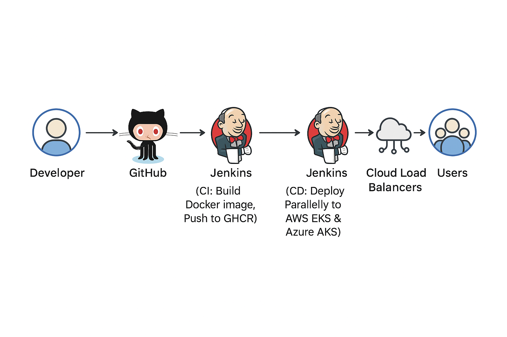

# Multi-Cloud Kubernetes CI/CD Pipeline for a Containerized Application
End-to-end CI/CD pipeline using Terraform, Jenkins, Docker, and Kubernetes on AWS & Azure;


## 1. Project Overview

  This project demonstrates a complete, end-to-end CI/CD pipeline for deploying a simple Python web application to two different cloud providers: Amazon Web Services (AWS) and Microsoft Azure. The entire infrastructure is managed as code using Terraform, and the pipeline is orchestrated by Jenkins.

 The primary goal is to showcase a robust, automated, and multi-cloud deployment strategy, which is a common requirement in modern, resilient systems.

---

## 2. Architecture Diagram

  

 **Workflow:**
 1.  A developer pushes code to the GitHub repository.
 2.  A GitHub webhook triggers the Jenkins pipeline.
 3.  Jenkins checks out the code, builds a Docker image, and pushes it to Docker Hub.
 4.  The Jenkins pipeline connects to the target cloud (AWS or Azure).
 5.  Terraform provisions the necessary infrastructure (VPC, Kubernetes Cluster).
 6.  Jenkins deploys the application to the Kubernetes cluster using the manifest files.
 7.  The application is accessible to the end-user via a public Load Balancer.

---


## 3. Tech Stack & Tools

 *   **Version Control:** Git & GitHub
 *   **Containerization:** Docker
 *   **Application:** Python (Flask)
 *   **CI/CD:** Jenkins
 *   **Infrastructure as Code (IaC):** Terraform
 *   **Cloud Providers:** AWS, Azure
 *   **Container Orchestration:** Kubernetes (AWS EKS & Azure AKS)

---


## 4. Project Structure

 The repository is structured to separate concerns, making it clean and maintainable.

 ```
 ├── app.py                       # The Python Flask web application
 ├── requirements.txt             # Python dependencies for the application
 ├── Dockerfile                   # Instructions to build the application's Docker container
 ├── jenkins.Dockerfile           # Custom Dockerfile for the Jenkins Controller (includes Docker CLI)
 ├── kubernetes/                  # Kubernetes manifest files (managed by Kustomize)
 │   ├── base/                    # Common Kubernetes definitions
 │   │   ├── deployment.yaml
 │   │   ├── service.yaml
 │   │   └── kustomization.yaml
 │   └── overlays/                # Environment-specific configurations
 │       ├── aws/
 │       │   ├── kustomization.yaml
 │       │   └── patch-env.yaml   # Adds CLOUD_PROVIDER=AWS
 │       └── azure/
 │           ├── kustomization.yaml
 │           └── patch-env.yaml   # Adds CLOUD_PROVIDER=Azure
 ├── terraform/                   # Terraform code for infrastructure
 │   ├── main.tf                  # Defines AWS EKS, VPC, etc. (and Azure provider)
 │   ├── azure.tf                 # Defines Azure AKS cluster
 │   └── outputs.tf               # Defines Terraform outputs (e.g., kubeconfig commands)
 ├── Jenkinsfile                  # The CI/CD pipeline-as-code
 └── README.md                    # Project documentation (this file)
 ```
---


 ## 5. How to Run This Project

 ### Prerequisites

*   An **AWS Account** with Free Tier access.
*   An **Azure Account** with a Free Subscription.
*   A **GitHub Account**.
*   **Docker Desktop/Engine** installed and running locally.
*   All necessary CLIs and tools installed locally: **Git**, **AWS CLI**, **Azure CLI**.
*   **`kubectl`** (Kubernetes command-line tool) installed locally.
*   **`kustomize`** installed locally (if you plan to build Kustomize locally for testing).

### Step-by-Step Instructions

1.  **Clone the Repository:**
    ```bash
    git clone https://github.com/YOUR_GITHUB_USERNAME/multi-cloud-devops-pipeline.git
    cd multi-cloud-devops-pipeline
    ```
    *(Remember to replace `YOUR_GITHUB_USERNAME` with your actual GitHub username)*

2.  **Build and Test Application Locally (Optional but Recommended):**
    *   Before deploying, verify the application works locally. Replace `YOUR_GITHUB_USERNAME` with your GitHub username.
    ```bash
    # Build the Docker image
    docker build -t ghcr.io/YOUR_GITHUB_USERNAME/multi-cloud-devops-pipeline:latest .

    # Run the container (sets CLOUD_PROVIDER for local testing)
    docker run --rm -p 8080:80 -e CLOUD_PROVIDER="Local" ghcr.io/YOUR_GITHUB_USERNAME/multi-cloud-devops-pipeline:latest
    ```
    *   Navigate to `http://localhost:8080` in a browser to see the app running. Stop the container with `Ctrl + C` in the terminal.

3.  **Configure Cloud Credentials (Local CLI & Jenkins):**
    *   **Local AWS CLI:** Run `aws configure` and provide your Access Key ID and Secret Access Key. (This is used by Terraform locally).
    *   **Local Azure CLI:** Run `az login` to authenticate. (This is used by Terraform locally).
    *   **Jenkins GitHub Container Registry (GHCR) Credential:**
        1.  Go to your GitHub account settings -> **Developer settings** -> **Personal access tokens** -> **Tokens (classic)**.
        2.  Click **"Generate new token"** (select "Generate new token (classic)").
        3.  Give it a descriptive name (e.g., `jenkins-ghcr-push`) and set an expiration.
        4.  For **Scope**, grant only **`write:packages`** permission.
        5.  Click **"Generate token"** and **immediately copy the token.**
        6.  In Jenkins (access at `http://localhost:8080` once Jenkins is running) -> **Manage Jenkins** -> **Credentials** -> **(global)** -> **Add Credentials**.
            *   **Kind:** "Username with password"
            *   **Username:** Your GitHub username (e.g., `riteshn96`)
            *   **Password:** The GitHub PAT you just copied.
            *   **ID:** `ghcr-credentials` (This ID is referenced in `Jenkinsfile`)
    *   **Jenkins AWS Credential:**
        1.  In AWS IAM, create an IAM User with programmatic access or an IAM Role (for more advanced setups). Grant it permissions required for EKS operations (e.g., `AmazonEKSClusterPolicy`, `AmazonEKSWorkerNodePolicy`, `AmazonEC2ContainerRegistryReadOnly`, and specific `eks:UpdateKubeconfig` permissions).
        2.  In Jenkins -> **Manage Jenkins** -> **Credentials** -> **(global)** -> **Add Credentials**.
            *   **Kind:** "AWS Credentials"
            *   **ID:** `aws-credentials` (This ID is referenced in `Jenkinsfile`)
            *   Provide your AWS Access Key ID and Secret Access Key.
    *   **Jenkins Azure Credential:**
        1.  Create an Azure Service Principal (via Azure CLI: `az ad sp create-for-rbac --name "http://my-jenkins-sp" --role "Contributor" --scope "/subscriptions/YOUR_SUBSCRIPTION_ID"`). Note down the `appId` (Client ID), `password` (Client Secret), and `tenant` ID.
        2.  **Crucially:** Assign this Service Principal the **`Owner`** role on your **Resource Group** (`my-aks-resource-group`).
            *   In Azure Portal: Go to `my-aks-resource-group` -> **Access control (IAM)** -> **Add role assignment**.
            *   **Role:** `Owner`.
            *   **Members:** Select your Service Principal (using its `appId`/Client ID: `6f0b5fe9-c33c-4024-a801-e7ef8ac6e1fa`).
            *   **Conditions:** If your Azure environment enforces **Attribute-Based Access Control (ABAC) conditions** and you cannot select "None", you must choose **"Allow user to assign all roles (highly privileged)"** to satisfy the policy for delegation. This ensures the Service Principal has the necessary permissions for the pipeline.
        3.  In Jenkins -> **Manage Jenkins** -> **Credentials** -> **(global)** -> **Add Credentials**.
            *   **Kind:** "Azure Service Principal"
            *   **ID:** `azure-credentials` (This ID is referenced in `Jenkinsfile`)
            *   **Client ID:** The `appId` from your Service Principal
            *   **Client Secret:** The `password` from your Service Principal
            *   **Tenant ID:** The `tenant` ID from your Service Principal

4.  **Provision Cloud Infrastructure with Terraform:**
    *   **Navigate to `terraform/` directory:** `cd terraform`
    *   **Initialize Terraform:**
        ```bash
        terraform init
        ```
    *   **Create Terraform Workspaces:** This keeps your state files separate for different environments.
        ```bash
        terraform workspace new aws  # Or 'select default' if you used default for AWS
        terraform workspace new azure
        ```
    *   **Apply AWS Infrastructure (ensure you are in the `aws` workspace):**
        ```bash
        terraform workspace select aws
        terraform apply
        ```
        *   Confirm the plan by typing `yes`. This creates your AWS EKS cluster and VPC.
    *   **Apply Azure Infrastructure (ensure you are in the `azure` workspace):**
        ```bash
        terraform workspace select azure
        terraform apply
        ```
        *   Confirm the plan by typing `yes`. This creates your Azure AKS cluster and its Resource Group.

5.  **Restructure Kubernetes Manifests for Kustomize Overlays:**
    *   This step is crucial for managing multi-cloud configurations cleanly.
    *   **Restructure your `kubernetes` directory:**
        ```bash
        # From your project root:
        mkdir -p kubernetes/base
        mkdir -p kubernetes/overlays/aws
        mkdir -p kubernetes/overlays/azure
        mv kubernetes/*.yaml kubernetes/base/ # Move existing YAMLs to base
        # If your kustomization.yaml was directly under 'kubernetes/', move it:
        mv kubernetes/kustomization.yaml kubernetes/base/
        ```
    *   **Update `kubernetes/base/kustomization.yaml`:** This file defines the core resources. Remove the `images` block from it.
        ```yaml
        # kubernetes/base/kustomization.yaml
        apiVersion: kustomize.config.k8s.io/v1beta1
        kind: Kustomization
        resources:
          - deployment.yaml
          - service.yaml
        ```
    *   **Modify `kubernetes/base/deployment.yaml`:** Remove the hardcoded `CLOUD_PROVIDER` environment variable, as this will be added by the overlays.
        ```yaml
        # In kubernetes/base/deployment.yaml (REMOVE the env block for CLOUD_PROVIDER)
        apiVersion: apps/v1
        kind: Deployment
        metadata:
          name: my-web-app-deployment
        spec:
          replicas: 2
          selector:
            matchLabels: {app: my-web-app}
          template:
            metadata:
              labels: {app: my-web-app}
            spec:
              containers:
              - name: web-server-container
                image: ghcr.io/riteshn96/multi-cloud-devops-pipeline:latest # Kustomize will set the tag
                ports:
                - containerPort: 80
                # REMOVE THE ENV BLOCK HERE (if it exists):
                # - name: CLOUD_PROVIDER
                #   value: "AWS"
        ```
    *   **Create `kubernetes/overlays/aws/kustomization.yaml`:**
        ```yaml
        # kubernetes/overlays/aws/kustomization.yaml
        apiVersion: kustomize.config.k8s.io/v1beta1
        kind: Kustomization
        bases:
          - ../../base
        patches:
          - path: patch-env.yaml
            target:
              kind: Deployment
              name: my-web-app-deployment
        ```
    *   **Create `kubernetes/overlays/aws/patch-env.yaml`:** (This adds `CLOUD_PROVIDER=AWS`)
        ```yaml
        # kubernetes/overlays/aws/patch-env.yaml
        apiVersion: apps/v1
        kind: Deployment
        metadata:
          name: my-web-app-deployment
        spec:
          template:
            spec:
              containers:
              - name: web-server-container
                env:
                - name: CLOUD_PROVIDER
                  value: "AWS"
        ```
    *   **Create `kubernetes/overlays/azure/kustomization.yaml`:**
        ```yaml
        # kubernetes/overlays/azure/kustomization.yaml
        apiVersion: kustomize.config.k8s.io/v1beta1
        kind: Kustomization
        bases:
          - ../../base
        patches:
          - path: patch-env.yaml
            target:
              kind: Deployment
              name: my-web-app-deployment
        ```
    *   **Create `kubernetes/overlays/azure/patch-env.yaml`:** (This adds `CLOUD_PROVIDER=Azure`)
        ```yaml
        # kubernetes/overlays/azure/patch-env.yaml
        apiVersion: apps/v1
        kind: Deployment
        metadata:
          name: my-web-app-deployment
        spec:
          template:
            spec:
              containers:
              - name: web-server-container
                env:
                - name: CLOUD_PROVIDER
                  value: "Azure"
        ```

6.  **Set up Jenkins Server (Local Docker Instance):**
    *   We will run Jenkins in a custom Docker image that includes the necessary Docker CLI tools for it to manage pipeline agents.
    *   **Create `jenkins.Dockerfile`** in the root of your project:
        ```dockerfile
        # jenkins.Dockerfile
        FROM jenkins/jenkins:lts-jdk11
        USER root
        # Install Docker CLI and add jenkins user to the docker group
        RUN apt-get update && apt-get install -y lsb-release curl gpg
        RUN curl -fsSL https://download.docker.com/linux/debian/gpg | gpg --dearmor -o /usr/share/keyrings/docker-archive-keyring.gpg
        RUN echo "deb [arch=$(dpkg --print-architecture) signed-by=/usr/share/keyrings/docker-archive-keyring.gpg] https://download.docker.com/linux/debian $(lsb_release -cs) stable" | tee /etc/apt/sources.list.d/docker.list > /dev/null
        RUN apt-get update && apt-get install -y docker-ce-cli
        # Create 'docker' group if it doesn't exist and add the 'jenkins' user to it
        RUN groupadd -r docker || true && usermod -aG docker jenkins
        USER jenkins
        ```
    *   **Build your custom Jenkins image:**
        ```bash
        docker build -t my-custom-jenkins -f jenkins.Dockerfile .
        ```
    *   **Stop/Remove any old Jenkins containers/volumes:** (This ensures a clean start)
        ```bash
        docker stop jenkins-server
        docker rm jenkins-server
        docker volume rm jenkins_home
        ```
    *   **Run the custom Jenkins container:**
        ```bash
        docker run -d --name jenkins-server -p 8080:8080 -p 50000:50000 -v jenkins_home:/var/jenkins_home -v /var/run/docker.sock:/var/run/docker.sock my-custom-jenkins
        ```
    *   **Unlock Jenkins:** Wait 30-60 seconds for Jenkins to start, then get the password:
        ```bash
        docker exec jenkins-server cat /var/jenkins_home/secrets/initialAdminPassword
        ```
        Paste this into `http://localhost:8080` in your browser.
    *   **Install Plugins:** Choose "Install suggested plugins".
    *   **Create Admin User:** Create your Jenkins admin user.

7.  **Configure `kubectl` Locally (Optional, for manual verification):**
    *   **For EKS:** After `terraform apply` (in `aws` workspace), run `terraform output kubeconfig_command` and execute the output command. Then `kubectl get nodes`.
    *   **For AKS:** After `terraform apply` (in `azure` workspace), run `az aks get-credentials --resource-group YOUR_ACTUAL_AZURE_RESOURCE_GROUP_NAME --name YOUR_ACTUAL_AZURE_AKS_CLUSTER_NAME --overwrite-existing`. Then `kubectl get nodes`.

8.  **Set up Jenkins Pipeline Job:**
    *   In Jenkins (access at `http://localhost:8080`), go to **Manage Jenkins** -> **Plugins** -> **Available**. Search for and install the **"Docker Pipeline"** plugin.
    *   Go back to the Jenkins dashboard. Click **"New Item"**.
    *   **Item Name:** `multi-cloud-devops-pipeline`
    *   **Type:** Select `Pipeline`. Click `OK`.
    *   **Configuration:** Scroll to the "Pipeline" section.
        *   **Definition:** `Pipeline script from SCM`
        *   **SCM:** `Git`
        *   **Repository URL:** `https://github.com/YOUR_GITHUB_USERNAME/multi-cloud-devops-pipeline.git`
        *   **Branch Specifier:** `*/main`
        *   **Script Path:** `Jenkinsfile`
    *   **Save.**

9.  **Run the Jenkins Pipeline!**
    *   **Commit all your `Jenkinsfile` and `kubernetes/` folder changes to GitHub.**
    *   On the Jenkins job's page, click **"Build Now"**.
    *   Watch the **"Console Output"** of the running build. It should now proceed through all stages (Checkout, Build & Push, Deploy to AWS EKS, Deploy to Azure AKS) and end in **SUCCESS**.

10. **Verify the Cloud Deployments:**
    *   **AWS:** Get the Load Balancer URL from EKS: `kubectl get service my-web-app-service -n default` (look for `EXTERNAL-IP`). Open it in your browser. You should see "Hello, World! I am running on AWS!".
    *   **Azure:** Get the Load Balancer URL from AKS: First, ensure `kubectl` is configured for AKS (`az aks get-credentials --resource-group YOUR_ACTUAL_AZURE_RESOURCE_GROUP_NAME --name YOUR_ACTUAL_AZURE_AKS_CLUSTER_NAME --overwrite-existing`). Then, `kubectl get service my-web-app-service -n default`. Open it in your browser. You should see "Hello, World! I am running on Azure!".

---

## 6. Key DevOps Best Practices Implemented

*   **Infrastructure as Code (IaC):** All cloud infrastructure is defined declaratively using Terraform. This ensures environments are repeatable, version-controlled, and auditable, eliminating manual configuration drift.
*   **Everything as Code:** The application code (`app.py`), its dependencies (`requirements.txt`), and the containerization recipe (`Dockerfile`) are all version-controlled in Git. This provides a single source of truth for the application. Not just infrastructure, but the CI/CD pipeline (`Jenkinsfile`) and application deployment (`kubernetes/*.yaml`) are also stored as code in the same repository.
*   **Immutable Infrastructure:** We don't modify running containers. Instead, we build a new Docker image for every code change and deploy it. This leads to stable and predictable systems.
*   **Multi-Stage Docker Builds:** The `Dockerfile` uses a multi-stage build pattern. A `builder` stage is used to install dependencies, and the final image is built from a `slim` base, copying only the necessary application code and packages. This best practice significantly reduces the final image size, which improves security (smaller attack surface) and performance (faster downloads/deploys).
*   **Secrets Management:** Jenkins credentials store all sensitive keys (AWS, Azure, GHCR PAT). No secrets are hardcoded in the repository.
*   **Multi-Cloud Strategy:** Deploying to both AWS and Azure demonstrates a strategy for high availability and avoiding vendor lock-in.
*   **Pinned Dependencies for Reproducible Builds:** The `requirements.txt` file specifies exact versions for packages (e.g., `Flask==2.0.1`). This prevents unexpected build failures caused by upstream library updates and ensures that the Docker image is built with the same dependencies every time, leading to highly predictable and stable builds.
*   **Declarative Application Management (Kustomize):** Instead of using brittle `sed` commands to change the image tag in our Kubernetes manifests, we use `kustomize`. This allows us to declaratively manage our application configuration and create environment-specific overrides (like setting `CLOUD_PROVIDER` for AWS vs. Azure) from a common `base`. This is cleaner, less error-prone, and makes it trivial to manage different configurations for different environments.
*   **Specialized Pipeline Agents:** The `Jenkinsfile` utilizes specialized Docker images (e.g., `docker:24.0` for Docker operations, `alpine/k8s:1.27.5` for Kubernetes and cloud CLI operations) as temporary agents for specific stages. This ensures each stage has precisely the tools it needs without bloating the main Jenkins controller or previous stages.

---

## 7. Troubleshooting & Gotchas

This section logs common issues encountered during setup and their resolutions.

### Issue: `internal error` when creating a repository on Docker Hub

*   **Symptoms:** Docker Hub returned a generic "internal error" when trying to create a repository with a specific name (`multi-cloud-devops-pipeline`).
*   **Solution:** Pivoted from Docker Hub to the **GitHub Container Registry (GHCR)**, which is more tightly integrated with the project's source code repository. This demonstrates adaptability and knowledge of alternative, robust tooling.

### Issue: Pushed package not visible in the GitHub repository

*   **Symptoms:** After a successful `docker push` to `ghcr.io`, the package was not visible on the main repository page.
*   **Solution:** For the first push from a personal account, the package defaulted to **Private** visibility and was not automatically linked to the repository. The fix was to:
    1.  Navigate to my main GitHub profile's **"Packages"** tab.
    2.  Select the package and go into its **"Package settings"**.
    3.  Change the package visibility from **Private to Public**.
    4.  Use the **"Connect repository"** feature to manually link the package to this source code repository. Subsequent pushes will now update the linked package automatically.

### Issue: EKS Unsupported Kubernetes Version Error

*   **Symptoms:** The initial `terraform apply` failed with the error `InvalidParameterException: unsupported Kubernetes version 1.22`.
*   **Analysis:** This error indicated that AWS EKS no longer supports the creation of new clusters with Kubernetes version 1.22, which was specified in the Terraform module. Cloud providers regularly deprecate older versions for security and support reasons.
*   **Solution:** Update the `cluster_version` parameter in the `terraform/main.tf` file from `"1.22"` to a currently supported version, `"1.27"`.
*   **Lesson Learned:** Infrastructure as Code makes resolving such issues straightforward and repeatable. It also underscores the need to consult cloud provider documentation for supported versions when defining resources.

### Issue: Troubleshooting Terraform Outputs

*   **Symptoms:** After creating the EKS cluster, the `terraform output` command failed with `Warning: No outputs found` and subsequent attempts gave `Error: Unsupported attribute`.
*   **Analysis:** This was a two-part problem:
    1.  The `outputs.tf` file was not created in the correct directory initially, so Terraform didn't register it.
    2.  Once the file was created, the attributes used (`module.eks.cluster_name`) were incorrect for the specific version of the `terraform-aws-modules/eks/aws` module being used.
*   **Solution:**
    1.  Create the `outputs.tf` file in the correct `./terraform/` directory.
    2.  Use the `terraform console` command to inspect the available attributes of the `module.eks` object and discovered the correct attribute for the cluster's name was `module.eks.cluster_id`.
    3.  Also learned that the region could be sourced reliably using a data block: `data.aws_region.current.name`.
    4.  Update the `outputs.tf` file with the correct values.
*   **Lesson Learned:** When using third-party Terraform modules, it's crucial to consult their documentation or use tools like `terraform console` to inspect the exact output attributes they expose, as these can change between module versions.

### Issue: Pods Stuck in "Pending" State on EKS

*   **Symptoms:** After deploying the application with `kubectl apply`, the pods remained in a `Pending` state indefinitely.
*   **Analysis:** Investigation with `kubectl describe pod <pod-name>` showed `FailedScheduling` with `0/1 nodes are available: 1 Too many pods`. This indicated the worker node hit the maximum pod limit for its instance type. AWS EKS imposes a hard limit on pods per EC2 instance based on ENIs (`t2.micro` supports max 4 pods).
*   **Solution:** Modified the `terraform/main.tf` file to change the worker node `instance_types` from `["t2.micro"]` to `["t2.small"]` (which supports 11 pods), providing sufficient capacity.
*   **Lesson Learned:** When designing a Kubernetes cluster, it's critical to consider the pod density limits for your chosen instance types, not just CPU and memory resources.

### Issue: Debugging `ERR_CONNECTION_TIMED_OUT` for an EKS LoadBalancer Service

*   **Symptoms:** After deploying the application and service, pods were `Running` and the service had an `EXTERNAL-IP`, but accessing the URL resulted in a connection timeout.
*   **Systematic Debugging Process:**
    1.  Confirmed Security Group rules.
    2.  Launched a debug pod inside the cluster to test internal connectivity (`curl http://<service-cluster-ip>`), which was successful. This isolated the problem to external communication.
    3.  Identified the specific NodePort assigned to the service (`kubectl get service`).
    4.  Edited the worker node's Security Group inbound rules to allow traffic *only* on the exact NodePort from the Load Balancer's Security Group.
*   **Root Cause:** The default health checks from the Application Load Balancer (ALB) needed to reach the specific NodePort on the instances.
*   **Lesson Learned:** When debugging Kubernetes networking, it's critical to isolate the problem scope. Testing connectivity from *inside* the cluster (`pod-to-service`) is the fastest way to determine if the problem is internal or external.

### Issue: Jenkins Pipeline Fails with Internal Errors (`docker: not found`, Syntax, etc.)

*   **Symptoms:** A series of cascading errors occurred during Jenkins pipeline setup and execution, including `docker: not found`, `Invalid agent type "docker"`, `Expected a symbol`, `Expected to find ‘someKey "someValue"’`.
*   **Analysis:** This was a multi-layered problem stemming from:
    1.  Initial Jenkins controller image not having Docker CLI.
    2.  Missing "Docker Pipeline" plugin in Jenkins.
    3.  Incorrect Groovy syntax in `Jenkinsfile` (e.g., colons instead of equals for agent image, attempting declarative `agent` in `parallel` blocks, not wrapping scripted steps like `docker.image().inside` in `script { ... }` blocks).
*   **Solution:**
    1.  Installed the **"Docker Pipeline" plugin** via Jenkins UI.
    2.  Created a custom `jenkins.Dockerfile` to build a new Jenkins controller image (`my-custom-jenkins`) that pre-installs the `docker-ce-cli` and adds the `jenkins` user to the `docker` group, allowing it to manage other Docker containers.
    3.  Corrected `Jenkinsfile` syntax:
        *   Used `docker { image = '...' }` for agent definitions.
        *   Removed `agent` blocks from stages within `parallel`.
        *   Wrapped `docker.image('...').inside { ... }` blocks inside `script { ... }` for stages in the `parallel` section.
    *   This ensures each stage runs in a specialized Docker agent with correct tools and permissions.

### Issue: Azure CLI Installation Errors on Alpine Linux

*   **Symptoms:** Azure stage fails during Azure CLI installation or subsequent `az` commands with `command not found` or compilation errors like `Failed building wheel for psutil`.
*   **Analysis:** The `alpine/k8s:1.27.5` agent image is minimal and lacks necessary system-level and Python development dependencies for building Python packages (like `psutil`) and for running the Azure CLI installer script, which expects `apt-get` (Debian-based systems).
*   **Solution:** Manually install the Azure CLI and its Python/system dependencies for Alpine Linux using `apk` and `pip`:
    ```groovy
    sh 'apk add --no-cache python3 py3-pip py3-setuptools py3-wheel py3-cffi libffi-dev openssl-dev build-base python3-dev bash curl'
    sh 'pip install azure-cli'
    ```
    This ensures all necessary build tools and Python packages are present for `pip` to install `azure-cli` successfully, and `bash` and `curl` for the installer.

### Issue: Azure `AuthorizationFailed` Error

*   **Symptoms:** `az login` succeeds, but `az aks get-credentials` (or `listClusterUserCredential`, `listClusterAdminCredential`) fails with `(AuthorizationFailed) The client '...' does not have authorization...`.
*   **Analysis:** The Azure Service Principal, despite successful authentication, lacked the necessary Azure RBAC permissions on the AKS cluster or its containing Resource Group to retrieve credentials. This was sometimes compounded by strict Azure Policies enforcing ABAC conditions.
*   **Solution:**
    1.  Grant the Service Principal the **`Owner`** role at the **Resource Group** scope where your AKS cluster resides. This is a very powerful role that should resolve all direct access issues.
    2.  **If an Azure Policy enforces ABAC conditions** (and you cannot select "None" for "Conditions" during role assignment), you must choose **"Allow user to assign all roles (highly privileged)"** to satisfy the policy for delegation.
    3.  **Wait** 2-5 minutes after granting permissions for changes to propagate in Azure.

### Issue: Azure `ResourceGroupNotFound`

*   **Symptoms:** After resolving authentication/authorization issues, `az aks get-credentials` fails with `Resource group 'my-aks-resource-group' could not be found.`.
*   **Analysis:** This was a direct error indicating that the resource group or AKS cluster name specified in the `Jenkinsfile` environment variables (`AZURE_RG_NAME`, `AZURE_AKS_NAME`) did not precisely match the names in the Azure Portal (often due to case-sensitivity or a typo).
*   **Solution:** Double-check and **precisely match** the names in your `Jenkinsfile` with the exact names (including casing) as they appear in the Azure Portal.

---

## 8. Cleanup

To avoid incurring cloud costs, remember to destroy all infrastructure after you are finished.

```bash
# For PowerShell (Windows)
terraform workspace select aws ; terraform destroy
terraform workspace select azure ; terraform destroy
